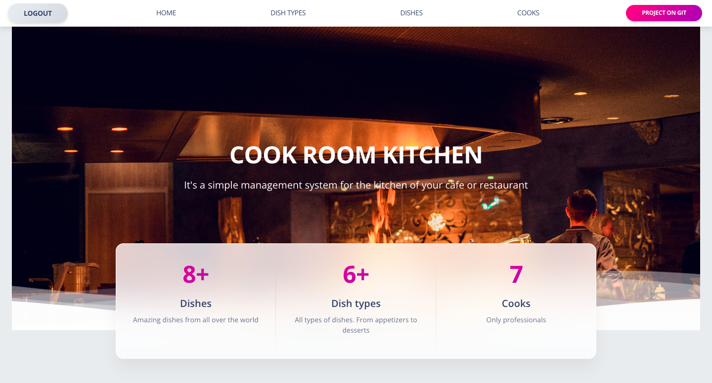

# Cook room kitchen project

Django project for managing dishes and cooks in café or restaurant kitchen

## Check in out!
[Cook room kitchen project deployed to Render](https://cook-room-kitchen.onrender.com/)

## Installation
Python3 must be already installed

```shell
git clone https://github.com/ostapT/cook-room-kitchen.git
cd cook-room-kitchen
python -m venv venv
source venv/bin/activate
pip install -r requirements.txt
python manage.py runserver #starts Django Server
```
## Credential for testing:
```angular2html
Login: User123
Password: kitchenpass123
```
## Features

* It's a useful tool for assigning cooks to certain dishes. 

* If needed, add new dishes to the menu.

* If there is a lack of dish categories, you can create a new one.

* An option to create accounts for a new cook is also implemented. As far as one has to be registered user to get access to the system.

* Only a registered user can create a new account, so no need to worry that a random person will get access to the system.

## Demo

